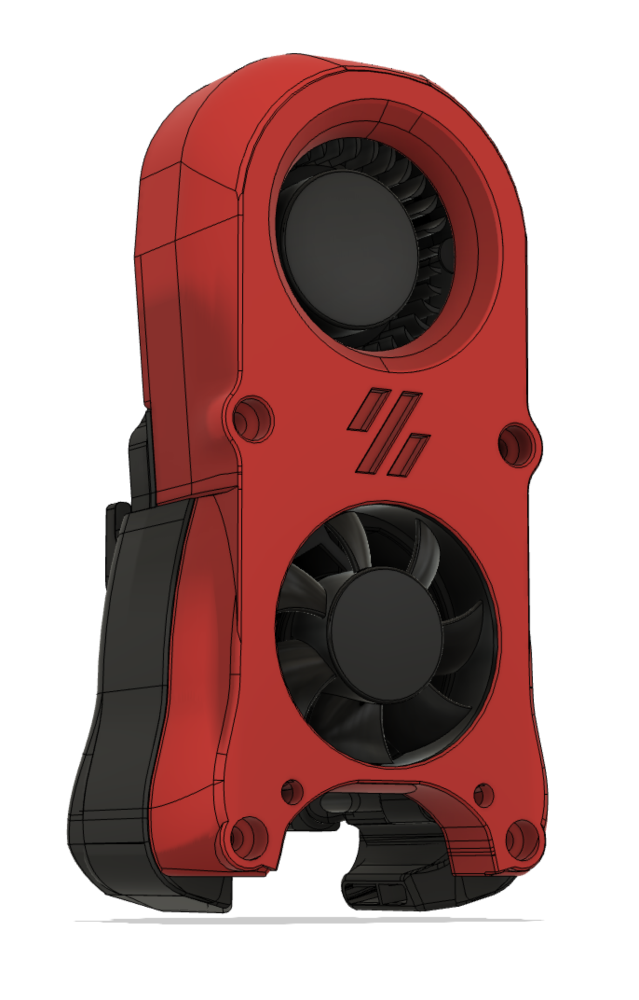

# AB-BN-30-Mod

## Notes:
Mod / Remix of Badnoob's AB-BN-30. (https://github.com/VoronDesign/VoronUsers/tree/master/printer_mods/Badnoob/AB-BN)

Added Voron logo to match style of the Mini Afterburner for the V0.1. The AB-BN-30 slightly too large to print on the V0.1 120mm build plate, so I have had to slice a few mm's from the bottom. 

If printing on a V0.1, rotate 45 degrees and adjust your infill angle accordingly. 

I have not yet printed and tested the logo insert. It's a 0.1mm tolerance.

## Printed Parts:
1. ab-bn-30-v01
2. ab-bn-30-logo-insert